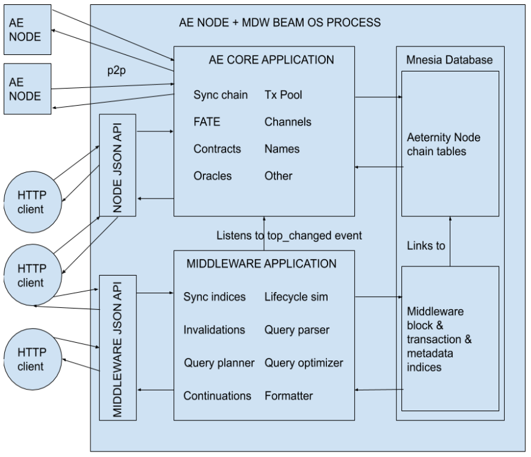
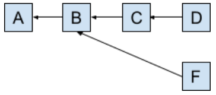

# AE MDW Architecture

The new Aeternity Middleware is a complete rewrite of the legacy middleware.

## Goals

* Improve the sync speed rapidly
* Make middleware lean, fast and easy to develop and deploy
* Reliable retrieving of information in batches (pagination)
* Allow complex search queries over history of transactions

Implementation keeping these goals in mind should result in a middleware usable
as a data source for the frontend, as well as a generic service component in any
other setup working with Aeternity chain.

## Design

The design decision with the greatest impact was to run the middleware logic in
the same BEAM process where AE node runs.

By using Elixir for implementation, we can understand middleware as an
application running alongside the AE node, via
[](https://github.com/aeternity/ae_plugin).

The extension of this decision is using the same database as AE node does -
Mnesia.

The benefits of these decisions were:

* No network transfers between middleware and AE node
* No network transfers between middleware and datastore
* Much simpler and cheaper flow of data
* Significant speedup in syncing (approx 100 times faster)
* Significant speedup when serving requests
* Greater stability (network isn't a variable factor anymore, all data are
  local)
* Easier deployment and upgrading

## Main components

Middleware could be understood as an application running inside of Aeternity
node OS process, along with Aecore application which implements the Aeternity
node logic.

Image below depicts how these two large blocks fit together.



## Database model

By merging the database types of AE node and Middleware, we can save a
significant amount of space and work with both datasets in the same way - using
Mnesia transactions and working with similar data model - sets of records.

The Middleware keeps track of several distinct types of information:

* Plain data indices - blocks, transactions and ids (public keys) inside
  transactions - keyed by integers or tuples of integers
* Objects with lifecycle - names and oracles - keyed by strings or hashes
* Supporting information - origin of objects and data, valency of public keys,
  name ownership and pointers
* Feature specific information - contract logs, events and calls, AEX9 (token)
  support

All DB tables used by Middleware are of type `ordered_set`. All keys of the
tables (except - oracle identifiers which are public keys) are then meaningfully
ordered - either by history (blocks, transactions) or lexicographically (names).

Plain data indices don't evolve - change their state - as the chain
progresses. A spend transaction (for example) is still the same transaction, 1
or 100K generations after it was executed.

Objects with the lifecycle are different. As the chain progresses, each object
changes its state at specific heights. The state of the object and height when
the state is changed depends on the sequence of transactions related to the
object.

For each new generation, the sync process needs to check if some objects
expired.

The lifecycle model of names are oracles have the following states:

* Claimed (after claim/register transaction, extended by update/extend
  transaction)
* Expired (happens automatically after time period (or, for names via revoke
  transaction))

Supporting information is needed for quick resolving of the origin (of name,
oracle, contract or channel) or database invalidations in case of chain fork
event. Another example of supporting information is tracking of the counts of
public keys in transaction fields. These counts are used for optimization of
transaction queries.

When constructing detailed replies to the requests, Middleware often looks into
data belonging to the AE node's Merkle-Patricia Tries.

### Plain data indices

#### Block index

The key and micro blocks are identified by hash, but for usable investigation of
history or specifying the scope we want to look into, integer indices are very
useful. From the hash of the block only, we can't know which generation the
block belongs to, and by extension, we don't know which block precedes it or
succeeds it.

The block index solves this by indexing the block hash with tuple in the format:
`{key_block_index, micro_block_index}`

`Key_block_index` identifies the generation (or height) of the block,
`micro_block_index` identifies the position of the micro block in the
generation.

Both indices start from 0, but since we are mapping two different types of block
to the same set, we need a special value of `micro_block_index` for the key
block. Since the key block starts the generation, and is followed by micro
blocks with micro block index from `0`, the special micro block index for key
block has always the value `-1`.

This ensures ordering of both key and micro blocks as per Erlang's term order.

The database model of the table record is defined as:

```
defrecord :block,
  [index: {-1, -1}, # {key_block_index, micro_block_index}
  tx_index: nil, # first transaction index in this block
  hash: <<>>] # block hash for lookup into AE node DB
```

Table holding these records is `Model.Block`.

#### Transaction index

Transaction index is a non-negative, always increasing integer, uniquely
identifying the transaction.

It is a fundamental piece of information used as a reference to transactions in
all other, specialized indices in the Middleware.

Specialized indices like time, type or field are not unique on their own, so for
the purpose of ensuring uniqueness of specialized index entries, transaction
index is part of the key. The database model of the table record is defined as:

```
defrecord :tx,
  [index: -1, # transaction index value
  id: <<>>, # transaction hash for lookup into AE node DB
  block_index: {-1, -1}, # in which block the tx resides
  time: -1] # micro block time in milliseconds
```

The table holding these records is `Model.Tx`.

The id/hash of the transaction is used for fetching the transaction details.

Since the transaction index is integer, it's easy to see which transaction
precedes or succeeds another transaction. Transaction index also allows us to
specify a scope (`start_index..end_index`) in the queries to state what we are
interested in.

##### Specialized index - time

The time index is useful for mapping time to the transaction. While the public
endpoints don't support time based queries, the internal query language supports
it.

The database model of the table record is defined as:

```
defrecord :time,
  [index: {-1, -1}, # as {micro block milliseconds, transaction index}
  unused: nil # Mnesia entries must have "value" field
```

Stored in table `Model.Time`.

The time (in milliseconds) marks when the whole micro block is added to the
DB. Since there can be many transactions in one micro block, the transaction
index is used in the key to keep uniqueness of the time entry.

##### Specialized index - type

The type index is mapping transaction type to the transactions. It allows us to
quickly filter transactions per transaction type, and are also used for queries
with multiple types or type groups.

The database model of the table record is defined as:

```
defrecord :type,
  [index: {nil, -1}, # as {transaction type, transaction index}
  unused: nil] # Mnesia entries must have "value" field
```

Stored in table `Model.Type`.

Similarly as in time record key, the transaction index serves the purpose of
keeping uniqueness of the type record.

#### Objects with lifecycle

Representing objects with a lifecycle is a lot more challenging than plain data.
While plain data like blocks or transactions are inserted once during syncing,
objects with lifecycles need to be actively managed and potentially updated
every time a new generation starts.

The simplified model of objects has states:

* in auction (some names only (*))
* active
* inactive

(*) names (without domain) shorter than 12 ascii characters and claimed after
Lima hard-fork

After objects expire, they are in an inactive state, and can be moved to an
active (or "in auction") state again. The periods during which the objects are
in an active state are called "epochs".

The state changes are tracked via manipulating of expiration table records
stored in object specific tables, defined as:

```
defrecord :expiration,
  [index: {nil, nil}, # {expiration height, object identifier}
  value: nil] # possible metadata
```

The states are mapped to DB tables - e.g. if some object is stored in it's
active table, we know the object is in active state. Changing states means
removing the object from one table, and inserting it into another. This way we
can conveniently list objects of specific state, and have them sorted
lexicographically where it makes sense (e.g. names).

For invalidation purposes, a lot of information in objects takes the shape named
as `bi_txi`: `{{key block index, micro block index}, transaction index}`

`bi_txi` allows us to quickly check if a particular transaction should be
reverted (by comparing the key block index with invalidation height).

##### Names

Names use following expiration tables for tracking generations when are the
states changed:

* `Model.AuctionExpiration`
* `Model.ActiveNameExpiration`
* `Model.InactiveNameExpiration`

The auction table record has following definition:

```
defrecord :auction_bid,
  # {name, bi_txi, expire height, owner, previous bids [bi_txi, ..]}
  [index: {nil, {{nil, nil}, nil}, nil, nil, nil},
  unused: nil]
```

The name table records represent both active and inactive names, depending on
the table there are stored:

```
defrecord :name,
  [index: nil, # plain name
  active: nil, # height from which name became active
  expire: nil, # height when the name expires (expired)
  claims: [], # claims (auction bids) as [bi_txi]
  updates: [], # updates as [bi_txi]
  transfers: [], # transfers as [bi_txi]
  revoke: nil, # revoke transaction as bi_txi or nil
  auction_timeout: 0, # if 0, name wasn't auctioned
  owner: nil, # owner's public key
  previous: nil] # previous version of the name as #name{}
```

Tables below store the actual objects:

* `Model.AuctionBid` (auction)
* `Model.ActiveName` (name)
* `Model.InactiveName` (name)

##### Oracles

Oracles use following expiration tables for tracking generations when are the
states changed:

* `Model.ActiveOracleExpiration`
* `Model.InactiveOracleExpiration`

The oracle table records represent both active and inactive oracles, depending
on the table there are stored in:

```
defrecord :oracle,
  [index: nil, # public key of the oracle
  active: nil, # height from which the oracle became active
  expire: nil, # height when the oracle expires (expired)
  register: nil, # registration bi_txi
  extends: [], # extensions a [bi_txi]
  previous: nil] # previous version of the oracle as #oracle{}
```

Tables below store the actual objects:

* `Model.ActiveOracle`
* `Model.InactiveOracle`

#### Supporting information

Tables for keeping supporting information are needed for several reasons:

##### Tracking origin of objects

When objects (with or without lifecycle) like contracts, channels, oracles and
names are created via their creation transaction, the identifier of such objects
is not part of the creation transaction. It is useful to maintain the mapping
between transactions and the created objects.

The origin table record has the following definition:

```
defrecord :origin,
  [index: {nil, nil, nil}, # {tx type, object pubkey, tx index}
  tx_id: nil] # transaction hash
  The records are stored in the Model.Origin table.
  For the query execution logic and invalidations, rev_origin table record is needed:
  defrecord :rev_origin,
  [index: {nil, nil, nil}, # {tx index, tx type, object pubkey}
  unused: nil]
```

Rev origin records are kept in the `Model.RevOrigin` table.

In both `origin` and `rev_origin` models, ideally we could represent the
necessary information without storing the transaction type. The reason why we
need transaction type here, is because oracles are identified with the same
public key as the account which created the oracle. Since we don't keep tags
(e.g.: `account_pubkey`, `contract`, `oracle`, ...) in our identifiers - just
public key binaries - the transaction type allows us to differentiate between
spend transactions and oracle transactions.

##### Tracking public keys inside transaction fields and their valency

The query language supports constructs where we can provide identifiers in the
transaction fields to match.

For illustration, a typical spend transaction looks as follows:

```
%{
  block_hash: <<201, 228, 14t6, …>>,
  block_height: 322515,
  hash: <<72, 94, 35, …>>,
  micro_index: 57,
  micro_time: 1601651331156,
  signatures: [<<1, 120, 56, ...>>],
  tx: %{
    amount: 20000,
    fee: 19320000000000,
    nonce: 3287310,
    payload: "322515:kh_2m...iH:1601651331",
    recipient_id: {:id, :account, <<123, 165, 128, ...>>},
    sender_id: {:id, :account, <<123, 165, 128, ...>>},
    ttl: 322525,
    type: :spend_tx
  },
  tx_index: 16284706
}
```

Here, the identifiers in transaction fields we index would be `sender_id` (at
position 1) and `recipient_id` (at position 2) - extracted from the AE node
spend transaction representation, having the fields: [`sender_id`,
`recipient_id`, `amount`, `fee`, `ttl`, `nonce`, `payload`].

The field table record allowing us to quickly operate on this information is
defined as:

```
defrecord :field,
  # {tx_type, tx_field_pos, object_pubkey, tx_index}
  [index: {nil, -1, nil, -1},
  unused: nil]
```

Records of this shape are stored in the `Model.Field` table.


When the query contains more than one transaction field to match, we have
several ways to search for the result. The role of the query optimizer is to
select the optimal way to traverse the tables. For this selection, the query
optimizer uses the counts of the occurrences of the public keys in the
transaction fields.

Below is the definition of the table records keeping this information:

```
defrecord :id_count,
  [index: {nil, nil, nil}, # {tx type, field position, object pubkey}
  count: 0] # valency
```

Records of this shape are stored in table `Model.IdCount`.

##### Tracking name ownership and pointees

The data stored by the AE node name system doesn't provide all the information
we want to be able to query. Due to this reason, we need to maintain separate
tables.

Tables `Model.AuctionOwner` and `Model.ActiveNameOwner` hold answers to the
query which names (in auction, or currently active) belong to a given owner
public key.

The table record is defined as:

```
defrecord :owner,
  [index: {pubkey, object}, # {owner pubkey, object pubkey}
  unused: nil]
```

Another table - `Model.Pointee` - holds answers to queries on who (which account
public key) points to a name. The table record are defined as:

```
defrecord :pointee,
  # {pointer value (name), {block index, tx index}, pointer key}
  [index: {nil, {{nil, nil}, nil}, nil},
  unused: nil]
```

## Syncing

The goal of the syncing process is to translate AE node data to actionable
middleware data which allows querying.

The syncing process listens to the AE node `top_changed` event and if the new
block is a key block extending the main chain, synchronizes the latest
generation.

This results in a middleware data being one generation behind the current AE
node generation. Theoretically we could synchronize data after every micro
block, but since checking if a block is in the main chain is costly and micro
forks happen quite often, synchronizing with a key block granularity is a
reasonable compromise.

The synchronization happens in two steps:

### 1. Assigning indices to the key and micro blocks

AE node's database keeps a tree shaped history of the evolution of the
chain. The main "trunk" of this tree - selected collectively by the difficulty
of the proof of work - represents the main chain. This main chain is linked
together by pointing to the previous top key block - by it's hash code of the
key block header.

But hash codes, on their own, don't keep information about the order of the key
blocks in the chain history, nor do the micro blocks keep information about
their order within the same generation.

Since it's very useful to provide the abstraction of a linear history to the
user, the Middleware follows the "previous" links of the key blocks and assigns
them a "key block index", equal to the height (or, generation) of the key block.

Each generation contains a set of micro blocks which hold the actual chain
transactions. We can sort this set of micro blocks in a similar way - by
following "previous" links - and assign them their order inside the
generation. This number would be an index starting from 0.

Key block index and micro block index form a "block index" (as tuple `{kbi,
mbi}`) - an unique, comparable index, identifying any block.

A micro block index of a key block is set to `-1`. This way a key block for the
generation is placed before its micro blocks.

### 2. Index and manage transaction data and objects

The second phase of synchronization of a generation serially executes several
steps.

#### Execute lifecycle simulation

With each new generation, middleware needs to check if there are objects with a
lifecycle - names or oracles - which need to move to another state. If there are
some, these transitions are executed - on the database level as moving an object
record from one table to another.

#### Assign indices to transactions

Similarly as blocks, transaction hash on its own doesn't provide information
regarding the order of the transaction in the whole chain history. Since we want
to provide the abstraction of a linear sequence of transactions, we need to
index the transaction with a non-negative integer which would uniquely identify
it.



#### Fill transaction feature tables

This is the step where we fill the tables. Each transaction has multiple
properties we want to query, and these properties are written into several
tables - type, time, fields with public keys and id count, possibly also
origin. If the transaction modifies an object with a lifecycle, additional
tables are filled - either origin table and supporting expiration tables, or
plain name table with pointees and name expiration tables.

### Detecting forks

When a new key block extends the chain, but that key block's "previous" link
doesn't point to a last key block of the main chain, a fork happens:

In the image above, the main chain consists of key blocks `A <- B <- C <- D`
(the arrows represent "previous" links).

A new key block `F` is a fork, because it doesn't point to `D` - which was the
last key block - but to a `B`, seen earlier. The new main chain is then `A <- B
<- F`.

In this situation we need to remove a part of the middleware data which was
added after key block `B` - invalidate generations `B` and `C`.

### Invalidations

The goal of the invalidations is to modify the Middleware DB tables so that
after the invalidations, the DB state is as it would have been if the fork
didn't happen. Or, in other words - travel back in time to the point before the
fork.

The need to perform invalidations stems from Middleware's promise to provide a
linear transaction history - from first to last transaction - without
alternative histories. When the fork happens, the history after the fork isn't
valid anymore and needs to be erased.

There are three approaches for invalidations, each applied to a different type
of data we need to manage.

#### Plain removal of table records

Block data in Model.Block and transaction data in tables `Model.Tx`,
`Model.Type`, `Model.Time`, `Model.Field`, `Model.Origin`, `Model.RevOrigin` are
simply deleted, and id counts in `Model.IdCount` are decreased.

#### Lifecycle model simulation

A more complex approach is needed for names and oracles. Several facts make this
non-trivial:

* objects can have different states at each block height
* objects may have several versions under the same identifier
* name objects can exist in two states simultaneously - inactive and in auction

Due to this complexity, the algorithm needs to determine:

* in what state(s) was the represented object at the time of the fork - what to
  delete
* in what state(s), and which version of the object is valid at the time we
  rollback to - what to write

#### Do nothing

`Model.PlainName` doesn't require any invalidations. This table keeps the
mapping of name hashes to plain names, and removing this mapping isn't worth the
effort. The assumption is that once a user finds out the name claim request
didn't land in the main chain, the request will be retried and exactly the same
record would be inserted again

## Database searching

All the functionality described above - database design, syncing,
invalidations - has one goal, to keep database records in a shape usable for
performing queries over transactions and additionally over lifecycle objects -
names and oracles.

### Object state query engine

Both name and oracle querying works conceptually in the same way. These objects
can be in several states - "inactive", "active", and in case of name also "in
auction". Objects in the same state are represented by two tables:

* Object table, keyed by identifier of the object (plain name for names and
  public key for oracles), e.g. `Model.InactiveName`, `Model.InactiveOracle`,
  `Model.ActiveName`, `Model.ActiveOracle`, `Model.AuctionBid`.
* Expiration table, keyed by tuple `{expiration height, identifier}`, e.g.
  `Model.InactiveNameExpiration`, `Model.InactiveOracleExpiration`,
  `Model.ActiveNameExpiration`, `Model.ActiveOracleExpiration`,
  `Model.AuctionExpiration`.

Both types of tables are sorted. This allows listing of names in any state
either by expiration date or plain name. Since listing of oracles by sorted
public keys doesn't make much sense, although technically possible, oracles are
listed by their expiration only. Since there aren't any filtering or selection
criteria needed for listing these objects (just state represented by a pair of
tables), no query planner is needed.

### Transaction query engine

The transaction query engine is a core functionality of the Middleware.

The query engine runs is several steps:

* utilize the indices in `Model.Type`, `Model.Time`, `Model.Field` and
  `Model.Tx` to construct all variants how to traverse and pull the matching
  records from the tables
* use `Model.IdCount` table to pick the optimal variant which would generate the
  stream of results
* wrap the optimal variant producing the results in lazy, on-demand stream

The query engine doesn't provide collecting or counting or additional processing
of the results - it's only goal is to return a stream of results, which can be
suspended and it's continuation stored and resumed later.

For collecting or counting or any other processing of the elements we can use
the standard Elixir's `Enum` and `Stream` functions.

#### Scope

Scope determines the direction of generation of the results with starting and
endpoint points.

Following options are supported:

* `:forward` - from beginning (genesis) to the end
* `:backward` - from end (top of chain) to the beginning
* `{:gen, a..b}` - from generation `a` to `b` (forward if `a < b`, backward
  otherwise)
* `{:txi, a..b}` - from transaction index a to b (forward if `a < b`, backward
  otherwise)

#### Clauses

Without clauses, the query engine returns transactions in requested scope and
direction. With clauses, the engine selects only results matching the clauses.

The clauses are key value pairs, where the keys can be:

* type constraints: `:type`, `:type_group`
* generic ids: `:account`, `:contract`, `:channel`, `:oracle`, `:name`
* freestanding fields: `:sender_id`, `:from_id`, `:contract_id`, ...
* typed fields: `:'spend.sender_id'`, `:'name_transfer.recipient_id'`, ...

The values are either transaction types (for `:type` and `:type_group`), plain
names (for `:name`) or identifiers - encoded public keys of accounts, contracts,
oracles and channels (for fields).

#### Logic combination

The query and result domains are fixed, therefore we can simplify the query
language by making the logic combinations among clauses implicit.

Since a transaction has exactly one type, the logic combination between type
constraints is OR. By listing several type constraints, we can construct any set
of transaction types we admit in the result. Adding more type constraints makes
the result set larger.

All other clauses - with generic ids and fields - are combined with AND. Adding
more id and field clauses makes the result set smaller.

Some examples of implicit logic combination:

* `DBS.map(:backward, :raw, type: :spend, type: :paying_for)`
  * return spend or paying for transactions
* `DBS.map(:backward, :raw, type_group: :channel, type_group: :contract)`
  * return any channel or any contract related transactions
* `DBS.map(:backward, :json, contract: "ct_2...", caller_id: "ak_H...")`
  * return transactions for given `contract` and `caller_id`

With implicit logic combinations we can drop grouping of the clauses with
parenthesis, which is useful as we want to parse these clauses as HTTP query
parameters.

Outside of query parsing dictated by a flat sequence of clauses represented as
HTTP parameters, the query engine also provides OR combination among sets of
clauses.

This combination is useful for advanced queries, merging disjoint sets of
transactions coming out from each top level set of clauses.

Example of this query:

```
DBS.map(:backward, :raw,
  {:or, [["name_claim.account_id": "ak_H..."],
        ["name_transfer.recipient_id": "ak_C"]]})
```

### Streaming batches

A call to `DBS.map`:

```
iex> DBS.map(:backward, :raw)
#Function<55.119101820/2 in Stream.resource/3>
```

returns a stream function. This example in particular, when forced, returns a
list of all transactions in history. We can force collection to list via
`Enum.to_list/1` or count the number of entries via `Enum.count/1`. If we force
the stream above it would take several hours. Since Middleware endpoints support
pagination - listing of batches on demand, we need to manage the results stream
in a fashion where we are able to both pull from the stream and store its
continuation for future pulling.

We can achieve this effect via `StreamSplit` library:

```
iex> {res, cont} = 1..1000 |> StreamSplit.take_and_drop(10)
{[1, 2, 3, 4, 5, 6, 7, 8, 9, 10],
%StreamSplit{
  continuation: #Function<0.121244055/1 in Enumerable.Range.reduce/5>,
  stream: #Function<55.119101820/2 in Stream.resource/3>
}}

iex> {res, cont} = cont |> StreamSplit.take_and_drop(10)
{[11, 12, 13, 14, 15, 16, 17, 18, 19, 20],
%StreamSplit{
  continuation: #Function<0.121244055/1 in Enumerable.Range.reduce/5>,
  stream: #Function<55.119101820/2 in Stream.resource/3>
}}
```

The range `1..1000` returns a stream, similar to the one from `DBS.map`. Via
calling `StreamSplit.take_and_drop/2` we can pull the elements, and store the
continuation of the stream for later.

We use a similar mechanism to storing the continuations for HTTP endpoints
requests.

#### Continuation identification

When the client asks for another page of results of the query, we need to pick
the correct continuation. For this purpose, we need to identify which
continuation to use from those already stored.

We identify the continuation by normalizing the query parameters, sorting them,
and removing the parameters `page` (which page we ask for) and `limit` (how many
entries we want in the reply).

From `page` and `limit`, we can compute the `offset` - nth entry to continue
from. These normalized and sorted query parameters along with `offset` form a
continuation key. If the continuation table has a value for this key, it's the
continuation to use for generating another batch. Once a continuation is used
for pulling a next batch, the next continuation of the same query with updated
offset is stored to the continuation table.

With this approach, we are able to determine if a rogue client doesn't want to
DDOS the Middleware by selecting millions of transactions and skipping hundreds
of thousands to generate a reply.

## Appendix - reasons for a new Middleware

We will summarize the main defects of previous middleware and the need for the
rewrite.

The legacy middleware consisted of several hosts:

* Aeternity Node for synchronization and sourcing the chain data
* PostgreSQL for keeping denormalized chain data
* Server in Rust for business logic and managing requests
* Optional NodeJS for server side rendering

The main defects are summarized below.

### Complexity

Splitting the functionality between logic, data and presentation parts is a
common industry practice. However, it doesn't mean that this architecture should
be used everywhere, especially when we want a lean, simple and fast software
stack.

Old middleware has 3-4 diverse components, where data is stored in 2 locations -
AE node, and SQL host.

New middleware has 2 components which are operationally just one OS process -
the AE node with Middleware extensions, with additional middleware data in the
same DB used by AE node as well.

### Instability

The instability stems from breaking down the functionality into several
components which must communicate via network. Synchronization step requires 2
network requests (4 transmissions, as request/reply) - fetching data from the
node and then inserting data to the SQL.

Client reply requires either DB network request or AE node network request,
sometimes both. Network performance varies, connections between different parts
of the service sometimes break.

Another large source of service breakage is when a fork happens in the chain,
resulting in crashes of the Rust server.

### Lack of performance

Once the legacy Middleware synchronizes, the performance is tolerable, sans
occasional response time spikes.

The main problem is synchronization performance. In a hosted environment, with
400K+ generations, synchronization from scratch would take several
months. Asking for data via a public AE Node endpoint, with necessary JSON
encoding/decoding for network transfer is simply way too slow.

New Middleware completely removed intra service network traffic. By placing
Middleware into the AE node, we can synchronize Middleware data in less than a
day.

### Incorrectness

Legacy middleware has severely broken support for paginations. Many endpoints
return just the first page and rely on retrieving older data via
paginations. There are two major issues.

Requesting a page doesn't remember the starting position - e.g. page 2 can
return the same transactions as page 1 if the top of the chain changed between
requests.

Fetching data for pages from SQL doesn't use SQL cursors - it collects all
entries up to those which should be in the reply, and discards all except those
in the requested page. Pagination is then progressively slower with each
subsequent page.

Besides pagination being incorrect, wasteful and slow, they also allow DDOSing
of the service. Malicious user just needs to send a request to a paginable
endpoint, asking for a very high numbered page. This way the legacy Middleware
can be tricked to collect millions of entries and trash the DB.

### Lack of flexibility

While legacy Middleware uses the SQL for storing the denormalized data model of
the chain, public endpoints don't provide any means for more flexible searching
of the transaction history. The endpoints were designed only for a single
purpose - to support frontend application. Another large use case, using
Middleware as part of the stack for other, non-frontend related logic, is not
possible with legacy Middleware.
