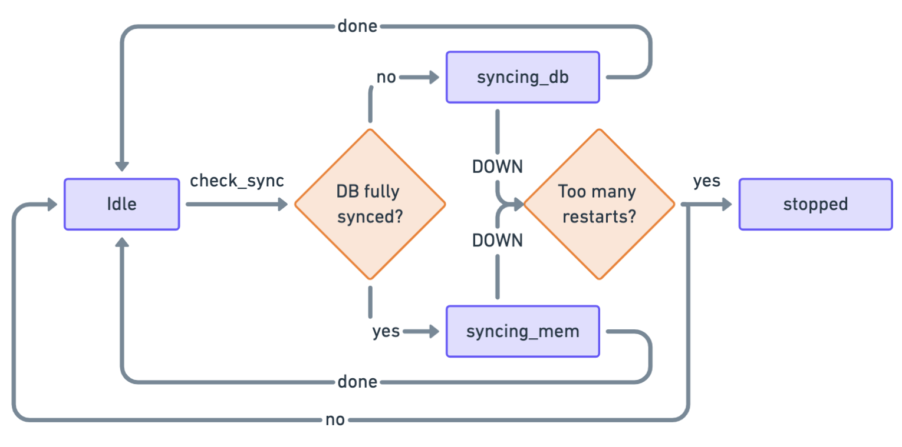

# AE MDW Architecture

The new Aeternity Middleware is a complete rewrite of the legacy middleware.

## Goals

* **Versioned API**: Implement a versioning strategy for the API to ensure
  backward compatibility and allow for future updates without breaking existing
  integrations. This helps to manage changes and provide a stable interface for
  clients.
* **Rapid Sync Speed**: Optimize the sync process to achieve faster data
  synchronization. This can involve improving algorithms, utilizing parallel
  processing, optimizing database queries, or implementing efficient caching
  mechanisms. By reducing sync times, you can provide real-time or near real-time
  data updates to users.
* **Lean, Fast, and Easy Development and Deployment**: Focus on improving the
  middleware's performance, reducing resource consumption, and enhancing its
  development and deployment process. Employ efficient coding practices,
  utilize lightweight frameworks, and automate deployment pipelines to streamline
  development and ensure faster, hassle-free deployments.
* **Reliable Paginated Retrieval**: Enhance the API endpoints to support reliable
  paginated retrieval of information. Implement mechanisms such as cursor-based
  pagination or offset-based pagination to allow clients to retrieve data in
  manageable chunks, improving performance and preventing overwhelming large
  result sets.
* **Complex Search Queries**: Enable the ability to perform complex search queries
  across multiple endpoints. Implement advanced search capabilities, such as
  filtering, sorting, and aggregations, to empower users to retrieve specific and
  relevant information from the middleware. This can be achieved by integrating
  powerful search engines or implementing custom search functionalities.

Implementation keeping these goals in mind should result in a middleware usable
as a data source for the frontend, as well as a generic service component in any
other setup working with Aeternity chain.

## Design

The design decision with the greatest impact was to run the middleware logic in
the same BEAM process where AE node runs.

By using Elixir for implementation, we can understand middleware as an
application running alongside the AE node, via
[](https://github.com/aeternity/ae_plugin).

The extension of this decision is using the same database as AE node does (RocksDB).

The benefits of these decisions were:

* No network transfers between middleware and AE node
* No network transfers between middleware and datastore
* Much simpler and cheaper flow of data
* Significant speedup in syncing (approx 100 times faster)
* Significant speedup when serving requests
* Greater stability (network isn't a variable factor anymore, all data are
  local)
* Easier deployment and upgrading

## Main components

Middleware could be understood as an application running inside of Aeternity
node OS process, along with Aecore application which implements the Aeternity
node logic.

Image below depicts how these two large blocks fit together.


## Database model

By merging the database types of AE node and Middleware, we can save a
significant amount of space and work with both datasets in the same way - using
RocksDB transactions and working with similar data model - sets of records.

The Middleware keeps track of several distinct types of information:

* Plain data indices - blocks, transactions and ids (public keys) inside
  transactions - keyed by integers or tuples of integers
* Objects with lifecycle - names, oracles and channels - keyed by strings or hashes
* Supporting information - origin of objects and data, valency of public keys,
  name ownership and pointers
* Feature specific information - contract logs, events and calls, AEx9 and AEx141 (token)
  support

All DB tables used by Middleware are of type `ordered_set`. All keys of the
tables (except - oracle identifiers which are public keys) are then meaningfully
ordered - either by history (blocks, transactions) or lexicographically (names).

Plain data indices don't evolve - change their state - as the chain
progresses. A spend transaction (for example) is still the same transaction, 1
or 100K generations after it was executed.

Objects with the lifecycle are different. As the chain progresses, each object
changes its state at specific heights. The state of the object and height when
the state is changed depends on the sequence of transactions related to the
object.

For each new generation, the sync process needs to check if some objects
expired.

The lifecycle model of names, oracles and channels have the following states:

* `active` - after claim/create/register transaction, extended by update/extend
  transaction
* `inactive` - happens automatically after time period (or, for names via revoke
  or close transactions)

Supporting information is needed for quick resolving of the origin (of name,
oracle, contract or channel) or database invalidations in case of chain fork
event. Another example of supporting information is tracking of the counts of
public keys in transaction fields. These counts are used for optimization of
transaction queries.

When constructing detailed replies to the requests, Middleware often looks into
data belonging to the AE node's Merkle-Patricia Tries.

### Plain data indices

#### Block index

The key and micro blocks are identified by hash, but for usable investigation of
history or specifying the scope we want to look into, integer indices are very
useful. From the hash of the block only, we can't know which generation the
block belongs to, and by extension, we don't know which block precedes it or
succeeds it.

The block index solves this by indexing the block hash with tuple in the format:
`{key_block_index, micro_block_index}`

`key_block_index` identifies the generation (or height) of the block,
`micro_block_index` identifies the position of the micro block in the
generation.

Both indices start from 0, but since we are mapping two different types of block
to the same set, we need a special value of `micro_block_index` for the key
block. Since the key block starts the generation, and is followed by micro
blocks with micro block index from `0`, the special micro block index for key
block has always the value `-1`.

This ensures ordering of both key and micro blocks as per Erlang's term order.

The database model of the table record is defined as:

```elixir
defrecord :block,
  [index: {-1, -1}, # {key_block_index, micro_block_index}
  tx_index: nil, # first transaction index in this block
  hash: <<>>] # block hash for lookup into AE node DB
```

Table holding these records is `Model.Block`.

#### Transaction index

Transaction index is a non-negative, always increasing integer, uniquely
identifying the transaction.

It is a fundamental piece of information used as a reference to transactions in
all other, specialized indices in the Middleware.

Specialized indices like time, type or field are not unique on their own, so for
the purpose of ensuring uniqueness of specialized index entries, transaction
index is part of the key. The database model of the table record is defined as:

```elixir
defrecord :tx,
  [index: -1, # transaction index value
  id: <<>>, # transaction hash for lookup into AE node DB
  block_index: {-1, -1}, # in which block the tx resides
  time: -1] # micro block time in milliseconds
```

The table holding these records is `Model.Tx`.

The id/hash of the transaction is used for fetching the transaction details.

Since the transaction index is an integer, it's easy to see which transaction
precedes or succeeds another transaction. Transaction index also allows us to
specify a scope (`start_index..end_index`) in the queries to state what we are
interested in.

##### Specialized index - time

The time index is useful for mapping time to the transaction. While the public
endpoints don't support time based queries, the internal query language supports
it.

The database model of the table record is defined as:

```elixir
defrecord :time,
  [index: {-1, -1}, # as {micro block milliseconds, transaction index}
  unused: nil # unused as RocksDB value
```

Stored in table `Model.Time`.

The time (in milliseconds) marks when the whole micro block is added to the
DB. Since there can be many transactions in one micro block, the transaction
index is used in the key to keep uniqueness of the time entry.

##### Specialized index - type

The type index is mapping transaction type to the transactions. It allows us to
quickly filter transactions per transaction type, and are also used for queries
with multiple types or type groups.

The database model of the table record is defined as:

```elixir
defrecord :type,
  [index: {nil, -1}, # as {transaction type, transaction index}
  unused: nil] # unused as RocksDB value
```

Stored in table `Model.Type`.

Similarly as in time record key, the transaction index serves the purpose of
keeping uniqueness of the type record.

#### Objects with lifecycle

Representing objects with a lifecycle is a lot more challenging than plain data.
While plain data like blocks or transactions are inserted once during syncing,
objects with lifecycles need to be actively managed and potentially updated
every time a new generation starts.

The simplified model of objects has states:

* in auction (some names only (*))
* active
* inactive

(*) names (without domain) shorter than 12 ascii characters and claimed after
Lima hard-fork

After objects expire, they are in an inactive state, and can be moved to an
active (or "in auction") state again. The periods during which the objects are
in an active state are called "epochs".

The state changes are tracked via manipulating of expiration table records
stored in object specific tables, defined as:

```elixir
defrecord :expiration,
  [index: {nil, nil}, # {expiration height, object identifier}
  value: nil] # possible metadata
```

The states are mapped to DB tables - e.g. if some object is stored in it's
active table, we know the object is in active state. Changing states means
removing the object from one table, and inserting it into another. This way we
can conveniently list objects of specific state, and have them sorted
lexicographically where it makes sense (e.g. names).

A lot of information in objects takes the shape named as `bi_txi_idx`, composed of
`{block_index, txi_idx}` where the block index is `{key block index, micro block index}`
and the `txi_idx` is composed of `{transaction index, contract call index}` where the
contract call index is `-1` is the raw transaction (no contract call) is being referenced.

##### Names

Names use following expiration tables for tracking generations when are the
states changed:

* `Model.AuctionExpiration`
* `Model.ActiveNameExpiration`
* `Model.InactiveNameExpiration`
* `Model.ActiveOracleExpiration`
* `Model.InactiveOracleExpiration`
* `Model.OracleQueryExpiration`

The auction table record has following definition:

```elixir
defrecord :auction_bid,
  # ame, bi_txi, expire height, owner, previous bids [bi_txi, ..]}
  [index: plain_name(),
   block_index_txi_idx: bi_txi_idx(),
   expire_height: height(),
   owner: pubkey(),
   bids: [bi_txi_idx()]]
```

The name table records represent both active and inactive names, depending on
the table there are stored:

```elixir
defrecord :name,
  [index: nil, # plain name
  active: nil, # height from which name became active
  expire: nil, # height when the name expires (expired)
  claims: [], # claims (auction bids) as [bi_txi]
  updates: [], # updates as [bi_txi]
  transfers: [], # transfers as [bi_txi]
  revoke: nil, # revoke transaction as bi_txi or nil
  auction_timeout: 0, # if 0, name wasn't auctioned
  owner: nil, # owner's public key
  previous: nil] # previous version of the name as #name{}
```

Tables below store the actual objects:

* `Model.AuctionBid` (auction)
* `Model.ActiveName` (name)
* `Model.InactiveName` (name)

##### Oracles

Oracles use following expiration tables for tracking generations when are the
states changed:

* `Model.ActiveOracleExpiration`
* `Model.InactiveOracleExpiration`

The oracle table records represent both active and inactive oracles, depending
on the table there are stored in:

```elixir
defrecord :oracle,
  [index: nil, # public key of the oracle
  active: nil, # height from which the oracle became active
  expire: nil, # height when the oracle expires (expired)
  register: nil, # registration bi_txi
  extends: [], # extensions a [bi_txi]
  previous: nil] # previous version of the oracle as #oracle{}
```

Tables below store the actual objects:

* `Model.ActiveOracle`
* `Model.InactiveOracle`

#### Supporting information

Tables for keeping supporting information are needed for several reasons:

##### Tracking origin of objects

When objects (with or without lifecycle) like contracts, channels, oracles and
names are created via their creation transaction, the identifier of such objects
is not part of the creation transaction. It is useful to maintain the mapping
between transactions and the created objects.

The origin table record has the following definition:

```elixir
defrecord :origin,
  [index: {nil, nil, nil}, # {tx type, object pubkey, tx index}
  tx_id: nil] # transaction hash
  # The records are stored in the Model.Origin table.
  # For the query execution logic and invalidations, rev_origin table record is needed:
defrecord :rev_origin,
  [index: {nil, nil, nil}, # {tx index, tx type, object pubkey}
  unused: nil]
```

Rev origin records are kept in the `Model.RevOrigin` table.

In both `origin` and `rev_origin` models, ideally we could represent the
necessary information without storing the transaction type. The reason why we
need transaction type here, is because oracles are identified with the same
public key as the account which created the oracle. Since we don't keep tags
(e.g.: `account_pubkey`, `contract`, `oracle`, ...) in our identifiers - just
public key binaries - the transaction type allows us to differentiate between
spend transactions and oracle transactions.

##### Tracking public keys inside transaction fields and their valency

The query language supports constructs where we can provide identifiers in the
transaction fields to match.

For illustration, a typical spend transaction looks as follows:

```elixir
%{
  block_hash: <<201, 228, 14t6, …>>,
  block_height: 322515,
  hash: <<72, 94, 35, …>>,
  micro_index: 57,
  micro_time: 1601651331156,
  signatures: [<<1, 120, 56, ...>>],
  tx: %{
    amount: 20000,
    fee: 19320000000000,
    nonce: 3287310,
    payload: "322515:kh_2m...iH:1601651331",
    recipient_id: {:id, :account, <<123, 165, 128, ...>>},
    sender_id: {:id, :account, <<123, 165, 128, ...>>},
    ttl: 322525,
    type: :spend_tx
  },
  tx_index: 16284706
}
```

Here, the identifiers in transaction fields we index would be `sender_id` (at
position 1) and `recipient_id` (at position 2) - extracted from the AE node
spend transaction representation, having the fields: [`sender_id`,
`recipient_id`, `amount`, `fee`, `ttl`, `nonce`, `payload`].

The field table record allowing us to quickly operate on this information is
defined as:

```elixir
defrecord :field,
  # {tx_type, tx_field_pos, object_pubkey, tx_index}
  [index: {nil, -1, nil, -1},
  unused: nil]
```

Records of this shape are stored in the `Model.Field` table.

When the query contains more than one transaction field to match, we have
several ways to search for the result. The role of the query optimizer is to
select the optimal way to traverse the tables. For this selection, the query
optimizer uses the counts of the occurrences of the public keys in the
transaction fields.

Below is the definition of the table records keeping this information:

```elixir
defrecord :id_count,
  [index: {nil, nil, nil}, # {tx type, field position, object pubkey}
  count: 0] # valency
```

Records of this shape are stored in table `Model.IdCount`.

##### Tracking name ownership and pointees

The data stored by the AE node name system doesn't provide all the information
we want to be able to query. Due to this reason, we need to maintain separate
tables.

Tables `Model.AuctionOwner` and `Model.ActiveNameOwner` hold answers to the
query which names (in auction, or currently active) belong to a given owner
public key.

The table record is defined as:

```elixir
defrecord :owner,
  [index: {pubkey, object}, # {owner pubkey, object pubkey}
  unused: nil]
```

Another table - `Model.Pointee` - holds answers to queries on who (which account
public key) points to a name. The table record are defined as:

```elixir
defrecord :pointee,
  # {pointer value (name), {block index, tx index}, pointer key}
  [index: {nil, {{nil, nil}, nil}, nil},
  unused: nil]
```

## State and Store

On the latest version, a new concept called [`State`](lib/ae_mdw/db/state.ex)
has been introduced. This concept serves as a declarative representation of the
Middleware state, encompassing all the models and their key-value records in a
sorted manner.

The `State` is defined alongside its internal component called
[`Store`](lib/ae_mdw/db/store.ex). The purpose of the `Store` is to provide an
interface for getting, putting, and deleting values. This abstraction allows
for flexibility in defining various types of storage that may be needed. Here
are some examples:

  * [`DbStore`](lib/ae_mdw/db/db_store.ex): This implementation directly
    interacts with RocksDb, performing queries and storing data without relying
    on a transaction.
  * [`TxsDbStore`](lib/ae_mdw/db/txn_db_store.ex): This implementation
    encapsulates all operations within a `RocksDb` transaction.
  * [`MemStore`](lib/ae_mdw/db/mem_store.ex): This implementation stores
    operations in memory using a Map data structure.
  * [`NullStore`](test/support/ae_mdw/db/null_store.ex): This implementation
    does not return any results or store anything, primarily used for testing
    purposes.

By utilizing this functional abstraction, it becomes easier to perform
in-memory syncing for a specific range (e.g., the last 10 generations) while
retaining the rest of the data in a persistent storage system like RocksDb.
This approach allows for efficient data management and synchronization,
leveraging the benefits of both in-memory and persistent storage solutions.

## Syncing

The goal of the syncing process is to translate AE node data to actionable
middleware data which allows querying.

The syncing process (`AeMdw.Sync.Watcher`) listens to the AE node `top_changed`
event which references a new block added on the main chain. For every block
added, a new message is sent to the syncing server process
(`AeMdw.Sync.Server`) for it to be processed accordingly.

Synchronization happens in two steps:

First, the **top state of the chain is compared** to the top state of the
middleware to decide on which blocks to synchronize next. Once decided which
generations are going to be synced next **mutations** are built for each of the
key/micro blocks of these generations. Secondly, the mutations are then
executed.

In order to be able to synchronize and invalidate forks data fast, the
middleware stores the output of the sync data in two separate places:

* All data generated from the genesis up to 10 generations before the top block
  is stored in RocksDb tables (this is done using `AeMdw.Db.TxnDbStore`).
* Data from the last 10 generations is stored in memory using the
  `AeMdw.Db.MemStore`, this occurs almost instantly.

```
...---- First n - 10 gens -----> <-------------- Top 10 gens ----------------->
+-----+----+----+---------+-----+---------+----+----+----+-----+------+----+---
| ... K(n-11) | M0 | M1 | | ... | K(n-10) | M0 | M1 | M2 | ... | K(n) | M0 | M1
+-----+----+----+---------+-----+---------+----+----+----+-----+------+----+---
...--- Synced into Rocksdb ----> <----------- Synced into memory ------------->
```

Every time any of the last 10 generations change (via forks or new blocks
added), the new generations needed to be added onto the database are first
processed (if any), and then the new in-memory generations are processed.

When retrieving data through the endpoints, the `MemStore` is first queried,
and the results are merged with the data stored on the `DbStore`.

### Mutations

Mutations are meant to be a single, atomic database change. The most basic
mutation would be the `WriteMutation`, which simply writes a new record on a
table. More complex use cases are needed when you need to read from the
database to calculate the changes needed to be performed.

Here's an example of a `WriteMutation` usage:

```elixir
tx = Model.tx(index: 1, id: <<0, 21, 30>>, block_index: {1, 10}, time: 1_000_000)
mutation = WriteMutation.new(Model.Tx, tx)

state = State.new()
State.commit(state, [mutation])
```

### Sync Server states and transitions

The `Sync.Server` was built to be a `GenStateMachine`, which has the following
states:

* `:idle` - There's nothing to process yet.
* `:stopped` - The server failed too many times, it is now in a stopped state
  and will retry later.
* `{:syncing_db, ref}` - There's a new `Task` with reference `ref` which is
  syncing changes and writing them to the database.
* `{:syncing_mem, ref}` - There's a new `Task` with reference `ref` which is
  syncing changes and writing them to memory.

While in any state, if any new updates to the node change arrives
(`new_height`) the internal state of the `Server` is updated, and a
`check_sync` event is triggered.

While in `idle` state, if a `check_sync` event arrives, it is processed
accordingly:

* If there's at least 1 generation which should belong to the database but has
  not yet been synced, it spawns an new `Task` to store these changes and
  enters into `{:syncing_db, ref}` state. When the task is done, it triggers
  a `:done` event.
* If there's at least 1 key or micro block that is not yet part of the memory,
  it spawns a new `Task` to store these changes and enters into
  `{:syncing_mem, ref}` state. When the task is done it triggers a `:done`
  event.

Visualization of the different `Server` states:



###

## Database searching

All the functionality described above - database design, syncing  - has one
goal, to keep database records in a shape usable for performing queries over
transactions and additionally over lifecycle objects - names, channels and
 oracles.

### Object state query engine

Name, oracle and channels querying works conceptually in the same way. These
objects can be in several states - "inactive", "active", and in case of name
also "in auction". Objects in the same state are represented by these tables:

* Object table, keyed by identifier of the object (plain name for names and
  public key for oracles), e.g. `Model.InactiveName`, `Model.InactiveOracle`,
  `Model.ActiveName`, `Model.ActiveOracle`, `Model.AuctionBid`,
  `Model.ActiveChannel`, `Model.InactiveChannel`.
* Expiration table, keyed by tuple `{expiration height, identifier}`, e.g.
  `Model.InactiveNameExpiration`, `Model.InactiveOracleExpiration`,
  `Model.ActiveNameExpiration`, `Model.ActiveOracleExpiration`,
  `Model.AuctionExpiration`.
* Activation tables, keyed by the tuple `{activation height, identifier}`, e.g.
  `Model.ActiveNameActivation`, `Model.InactiveNameActivation`,
  `Model.ActiveChannelActivation`.

All these types of tables are sorted. This allows listing of names in any state
either by expiration date or plain name. Since listing of oracles by sorted
public keys doesn't make much sense, although technically possible, oracles are
listed by their expiration only. Since there aren't any filtering or selection
criteria needed for listing these objects (just state represented by a pair of
tables), no query planner is needed.

### Transaction query engine

The transaction query engine is a core functionality of the Middleware.

The query engine runs is several steps:

* utilize the indices in `Model.Type`, `Model.Time`, `Model.Field` and
  `Model.Tx` to construct all variants how to traverse and pull the matching
  records from the tables
* use `Model.IdCount` table to pick the optimal variant which would generate the
  stream of results
* wrap the optimal variant producing the results in lazy, on-demand stream

The query engine doesn't provide collecting or counting or additional processing
of the results - it's only goal is to return a stream of results, which can be
suspended and it's continuation stored and resumed later.

#### Clauses

Without clauses, the query engine returns transactions in requested scope and
direction. With clauses, the engine selects only results matching the clauses.

The clauses are key value pairs, where the keys can be:

* type constraints: `:type`, `:type_group`
* generic ids: `:account`, `:contract`, `:channel`, `:oracle`, `:name`
* freestanding fields: `:sender_id`, `:from_id`, `:contract_id`, ...
* typed fields: `:'spend.sender_id'`, `:'name_transfer.recipient_id'`, ...

The values are either transaction types (for `:type` and `:type_group`), plain
names (for `:name`) or identifiers - encoded public keys of accounts, contracts,
oracles and channels (for fields).

## Paginated endpoints and streams

Middleware acts as an indexing tool of the Node to provide users more useful and
friendlier information. This is done mostly by indexing data that can then be
queried through endpoints that provide a list of results.

Since the amount of results for these endpoints is unlimited and can ultimately
be a large number, all endpoints (since v2) are paginated by using cursors. A
**cursor** is a reference to the next record that should be returned on the
paginated list, and it should contain any information needed to reference it
(numbers, string, etc). This cursor is included as a query parameter and
returned on the `prev` and `next` URL of any paginated endpoint. The result
of the endpoint should end up looking like this:

```
{
  "data": [
    record1,
    record2,
    ...
  ],
  "next": "/v2/...?cursor=<cursor-next>"
  "prev": "/v2/...?cursor=<cursor-prev>"
}
```

### Internal representation

Internally, for all paginated endpoints, a stream is built that would then be
accesed to return the list of results. This is done by using regular
[`Elixir Streams`](https://hexdocs.pm/elixir/1.12/Stream.html), usually built
by using the `Collection.stream/3` or `Collection.stream/5` functions.

`Collection.stream(state, table, direction, scope, cursor)` iterates over the
keys provided by the state on that specific table, where:
* `state` is the [`State`](lib/ae_mdw/db/state.ex) object which requires a
  [`Store`](lib/ae_mdw/db/store.ex) to be initialized.
* `table` is the atom specifying the table name.
* `direction` is either `forward` or `backward`.
* `scope` is either `nil` or a tuple of two values `{first_key, last_key}`, this
  has to be provided in forward order (e.g. `first_key <= last_key` always).
* `cursor` is the initial key to start iterating from. If `nil` it will begin
  from the first element of the `scope`.

An example of its usage is the following:

```elixir
state = State.new()
stream = Collection.stream(state, Model.Tx, :forward, {200, 400}, 300)
Enum.take(stream, 4) # => [200, 201, 202, 203]

stream = Collection.stream(state, Model.ActiveName, :backward, nil, "c.chain")
Enum.take(stream, 4) # => ["c.chain", "ba.chain", "b.chain"]
```

In the first example, it iterates over the table `Model.Tx` where the keys are
a consecutive list of `txi` values. It begins at txi 300, iterating over values
up until 400.

`Collection.stream(state, table, cursor)` is a shorthand for
`Collection.stream(state, table, :forward, nil, cursor)`.

#### Scope and direction

All endpoints that are paginated allow you to specify query parameters to scope
and order the results presented. This is done via the `direction` and `scope`
query parameter.

Direction determines the order of the results, and it can be either
`direction=forward`  or `direction=backward`.

Scope allows to specify a range of generations endpoint points. The following
values are supported:

* `scope=gen:<a>-<b>` - from generation `a` to `b` (forward if `a < b`,
  backward otherwise). This is represented as `{:gen, a..b}` internally.
* `scope=txi:<a>-<b>` - from transaction index a to b (forward if `a < b`,
  backward otherwise). Represented as `{:txi, a..b}` internally. This last one
  is DEPRECATED, to avoid exposing internal information like `txi`, which is
  not a concept used in the node.


## Appendix - reasons for a new Middleware

We will summarize the main defects of previous middleware and the need for the
rewrite.

The legacy middleware consisted of several hosts:

* Aeternity Node for synchronization and sourcing the chain data
* PostgreSQL for keeping denormalized chain data
* Server in Rust for business logic and managing requests
* Optional NodeJS for server side rendering

The main defects are summarized below.

### Complexity

Splitting the functionality between logic, data and presentation parts is a
common industry practice. However, it doesn't mean that this architecture should
be used everywhere, especially when we want a lean, simple and fast software
stack.

Old middleware has 3-4 diverse components, where data is stored in 2 locations -
AE node, and SQL host.

New middleware has 2 components which are operationally just one OS process -
the AE node with Middleware extensions, with additional middleware data in the
same DB used by AE node as well.

### Instability

The instability stems from breaking down the functionality into several
components which must communicate via network. Synchronization step requires 2
network requests (4 transmissions, as request/reply) - fetching data from the
node and then inserting data to the SQL.

Client reply requires either DB network request or AE node network request,
sometimes both. Network performance varies, connections between different parts
of the service sometimes break.

Another large source of service breakage is when a fork happens in the chain,
resulting in crashes of the Rust server.

### Lack of performance

Once the legacy Middleware synchronizes, the performance is tolerable, sans
occasional response time spikes.

The main problem is synchronization performance. In a hosted environment, with
400K+ generations, synchronization from scratch would take several
months. Asking for data via a public AE Node endpoint, with necessary JSON
encoding/decoding for network transfer is simply way too slow.

New Middleware completely removed intra service network traffic. By placing
Middleware into the AE node, we can synchronize Middleware data in less than a
day.

### Incorrectness

Legacy middleware has severely broken support for paginations. Many endpoints
return just the first page and rely on retrieving older data via
paginations. There are two major issues.

Requesting a page doesn't remember the starting position - e.g. page 2 can
return the same transactions as page 1 if the top of the chain changed between
requests.

Fetching data for pages from SQL doesn't use SQL cursors - it collects all
entries up to those which should be in the reply, and discards all except those
in the requested page. Pagination is then progressively slower with each
subsequent page.

Besides pagination being incorrect, wasteful and slow, they also allow DDOSing
of the service. Malicious user just needs to send a request to a paginable
endpoint, asking for a very high numbered page. This way the legacy Middleware
can be tricked to collect millions of entries and trash the DB.

### Lack of flexibility

While legacy Middleware uses the SQL for storing the denormalized data model of
the chain, public endpoints don't provide any means for more flexible searching
of the transaction history. The endpoints were designed only for a single
purpose - to support frontend application. Another large use case, using
Middleware as part of the stack for other, non-frontend related logic, is not
possible with legacy Middleware.
